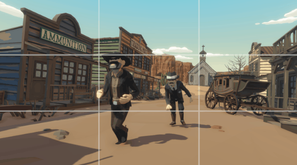
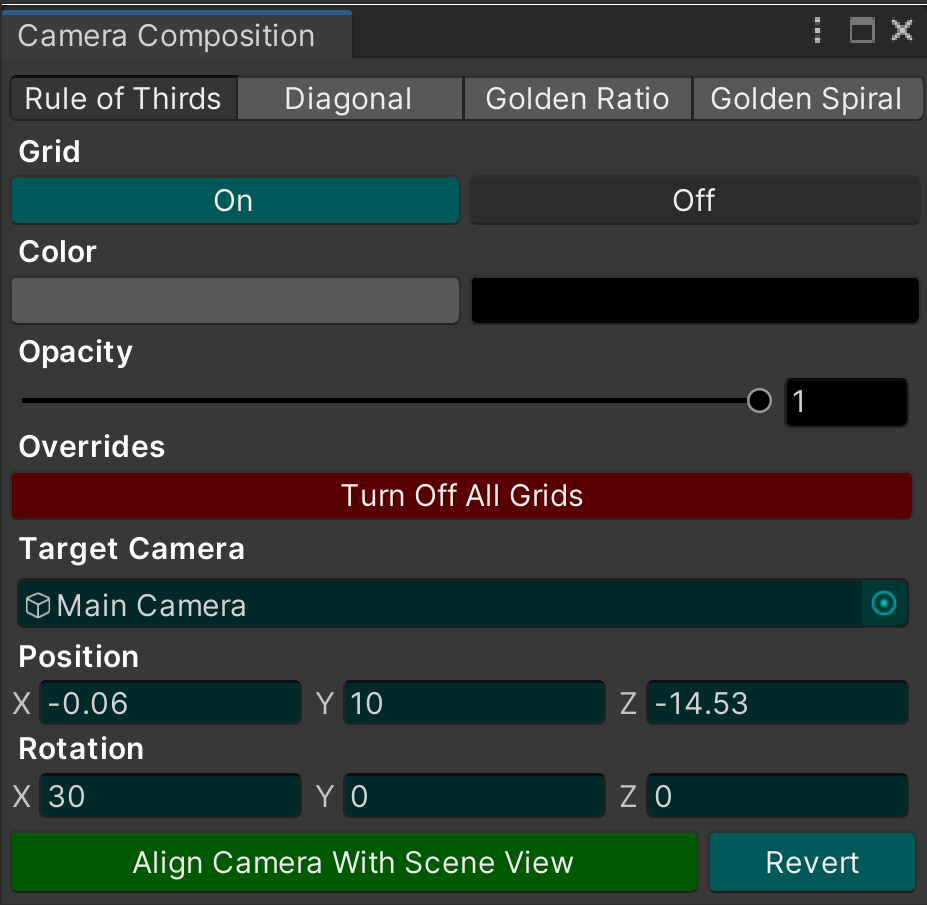

# Unity - Camera Composition - Grid Overlay Tool

**Camera Composition** is the ideal **Grid Overlay Tool** for precisely arranging
Unity cameras for screenshots, videos, marketing GIFs, cutscene sequences and more.

_"Get The Shot"_ with **Camera Composition**!

[Documentation](https://docs.google.com/document/d/1eceQLapMt2l11uRRauVmcrll81BtNNpcoJQ8P790Abc/edit?usp=sharing) |
[Video Tutorials](https://youtube.com/playlist?list=PLW7JM-u_dqgA2rYq5MrJfmKQ44q2_emNv) |
[Unity Asset Store](https://assetstore.unity.com/packages/tools/camera/camera-composition-grid-overlay-tool-202816) |
[Support](mailto:jordan@cassady.me) |
[Website](https://jordan.cassady.me/)

## Highlights

- Easy integration with existing projects and workflows.
- 4 grid overlays - Rule of Thirds, Diagonal, Golden Ratio, Golden Spiral.
- Color and opacity adjustments to optimize grid visibility.
- Target camera - precisely adjust position/rotation of game camera.
- "Align Camera With Scene View" shortcut button.
- Includes demo scenes for all grid overlays.
- 2D and 3D modes supported.

### Easy 3 Step Workflow

1. Turn on grid overlay.
2. Adjust position of target camera and scene objects.
3. Get the shot!

## Features
#### Multi-Grid Overlays

Enable any number of 4K resolution widescreen grids individually or simultaneously.

#### Grid Color Selection

Choose between black or white grid overlays for better visibility, depending on the scene.

#### Grid Opacity Slider

Adjust grid transparency to improve visibility of scene objects while composing the camera.

#### Grid Overrides

Turn off all enabled grids at once with the click of a button.

#### Rotation Buttons

Rotate the Golden Spiral grid overlay for additional composition possibilities.

## Contributing

Pull requests are welcome. For major changes, please open an issue first
to discuss what you would like to change.

## License

[MIT](https://choosealicense.com/licenses/mit/)
